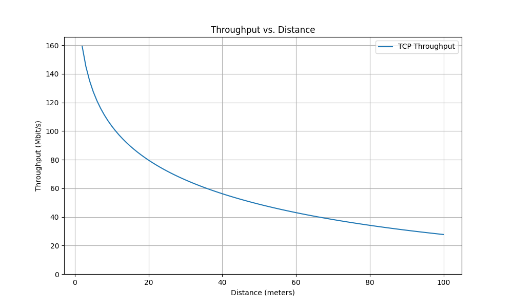

# wireless-throughput-model

This program will output the expected throughput over a given distance.
Make sure to edit the parameters in the main function.

The script "polynomial_bandwidth_snr_wifi.py" is used to get the polynomial approximation of WiFi data rate given bandwidth and SNR, of data taken from https://wlanprofessionals.com/mcs-table-and-how-to-use-it/

Polynomials of degree 2, 5 and 10 are good approximations in my opinion.

Main program in "throughput_over_distance.py".

Example output:
